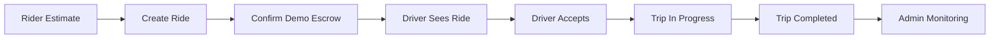
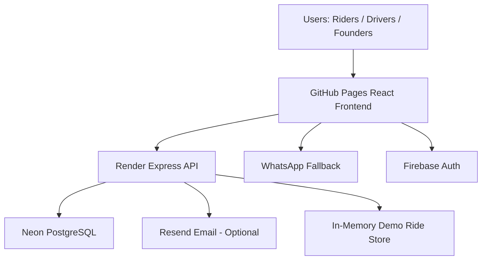

# LIBRE Ride-Sharing Dapp

> **Driver-first, escrow-protected ride sharing for Orlando mobility.**


**LIBRE is a Web3-enabled ride-sharing demo designed to prove a fairer mobility model** where riders get transparent pricing, drivers only see escrow-confirmed rides, and admins can monitor the full ride lifecycle. The first pilot focuses on the Orlando, Florida market — airport visitors, hotel guests, convention attendees, families, and local riders.

> ⚠️ LIBRE is currently a **demo / MVP**. No real transportation, payment, insurance, regulatory approval, or financial product is provided through this demo.

---

## 🔗 Quick Links

| Area | Link |
| --- | --- |
| Live App | [rigocrypto.github.io/Libre-Ride-Sharing-Dapp](https://rigocrypto.github.io/Libre-Ride-Sharing-Dapp/) |
| Rider Demo | [/rider](https://rigocrypto.github.io/Libre-Ride-Sharing-Dapp/rider) |
| Rider Profile | [/rider/profile](https://rigocrypto.github.io/Libre-Ride-Sharing-Dapp/rider/profile) |
| Driver Demo | [/driver](https://rigocrypto.github.io/Libre-Ride-Sharing-Dapp/driver) |
| Admin Demo | [/admin](https://rigocrypto.github.io/Libre-Ride-Sharing-Dapp/admin) |
| Founding Driver Registration | [/founding-access](https://rigocrypto.github.io/Libre-Ride-Sharing-Dapp/founding-access) |
| Privacy | [/privacy](https://rigocrypto.github.io/Libre-Ride-Sharing-Dapp/privacy) |
| Backend API Health | [libre-api.onrender.com/health](https://libre-api.onrender.com/health) |
| GitHub Repo | [github.com/rigocrypto/Libre-Ride-Sharing-Dapp](https://github.com/rigocrypto/Libre-Ride-Sharing-Dapp) |

---

## 📸 Product Screenshots

> Screenshots are captured from the live GitHub Pages demo. Drop PNGs into
> [`docs/images/`](docs/images/) (see the [capture guide](docs/images/README.md))
> to replace the placeholders below.

<!-- TODO: Add screenshots after the latest GitHub Pages deploy. Filenames below match docs/images/README.md. -->

### Landing / Founding Access
<!--  -->
_TODO: `docs/images/founding-access.png`_

### Rider Dashboard — Orlando Visitor Experience
<!--  -->
_TODO: `docs/images/rider-dashboard.png`_

### Rider Profile
<!--  -->
_TODO: `docs/images/rider-profile.png`_

### Driver Dashboard
<!--  -->
_TODO: `docs/images/driver-dashboard.png`_

### Admin Escrow Monitoring
<!--  -->
_TODO: `docs/images/admin-dashboard.png`_

---

## 🌎 Vision

LIBRE is not simply "Uber with crypto." It is designed around **fairness, driver control, rider transparency, escrow protection, and local community mobility.**

Traditional ride-sharing platforms often leave drivers with limited transparency, high platform dependency, unclear earnings logic, and little ownership in the ecosystem. LIBRE is being built around a different idea:

> Drivers should have more transparency, riders should have safer local options, and payments should be protected by modern digital infrastructure.

The Orlando pilot focuses on tourists, airport visitors, hotel guests, families, convention visitors, and local riders. The long-term vision is a **community-based mobility marketplace with transparent pricing and programmable payment flows.**

### Why Orlando?

- Heavy tourism demand and Orlando International Airport (MCO) traffic
- Disney, Universal, hotels, conventions, and event zones
- High driver activity and strong airport / tourist / family / local demand
- A clear need for transparent, driver-first alternatives

The first launch strategy focuses on a limited Orlando pilot before broader Florida or national expansion.

## ❗ The Problem

- Traditional ride-sharing platforms often lack transparency.
- Drivers may accept rides without clear payment guarantees.
- Riders face dynamic pricing and unclear fees.
- Local drivers have limited ownership and control.
- Tourists need safer, clearer, easier transportation options.
- Compliance, trust, and payment assurance are major barriers.

## ✅ The LIBRE Solution

- Rider requests a transparent ride and sees an up-front Orlando fare estimate.
- Payment is confirmed through demo escrow before the ride moves forward.
- Driver sees the ride **only after escrow confirmation** — protecting driver time.
- Admin can monitor the full ride lifecycle and escrow state.
- WhatsApp / email fallback protects founding-driver registrations.
- The demo proves the operating model **before real funds are involved.**

> **The key product difference:** LIBRE protects driver time by only showing rides after rider payment is escrow-confirmed. Riders get payment protection, drivers avoid unpaid or unconfirmed trips, and admins can monitor the full ride lifecycle.

---

## 🔄 Demo Lifecycle

1. Rider estimates an Orlando ride fare
2. Rider creates the ride request
3. Rider confirms demo escrow
4. Driver sees **only** escrow-confirmed rides
5. Driver accepts the ride
6. Driver starts the trip
7. Driver completes the trip
8. Admin verifies the completed state and payout release



### Recommended Walkthrough

1. Open `/rider`, choose an Orlando pickup and destination, and estimate the fare.
2. Create the ride and confirm demo escrow.
3. Open `/driver`, switch the driver status online, and confirm that **only** escrow-confirmed rides appear.
4. Accept, start, and complete the ride to release escrow.
5. Open `/admin` to review the full lifecycle: status, escrow state, fare, driver, and transaction reference.

> Demo / staging flow only. It does not use real passengers, real dispatch, real production funds, or production compliance checks.

---

## 🧩 Product Modules

### Rider Demo (`/rider`, `/rider/profile`)

- Orlando tourist-focused dashboard with destination presets
- Ride packages and transparent fare estimates
- Escrow explanation and demo wallet
- Safety and travel support + AI travel assistant
- Rider Profile / account page

### Driver Demo (`/driver`)

- Modern driver operations dashboard with KPI cards
- Demand map and escrow-confirmed ride visibility
- Earnings / wallet panel
- Safety & compliance panels, promotions / referrals
- AI driver tips

### Admin Demo (`/admin`)

- Ride lifecycle visibility and escrow status monitoring
- Completed ride tracking
- Demo operations view and system verification tools

### Founding Access (`/founding-access`)

- Founding Driver registration with referral code support
- WhatsApp fallback when the API is unavailable
- Neon-backed lead storage
- Optional, non-blocking confirmation email

---

## ⭐ Key Features

### For riders

- Transparent demo fares and Orlando destination presets
- Escrow-protected ride confirmation
- Tourist travel packages, rider profile, wallet / payment demo, safety & support

### For drivers

- Escrow-confirmed ride visibility (no wasted trips)
- Modern operations dashboard and earnings overview
- Safety / compliance panels, driver profile / status, referrals & promotions

### For admins

- Ride lifecycle and escrow-state monitoring
- Demo ride tracking and system verification tools

### For founders / operators

- Founding registration with Neon / Postgres lead storage
- Render backend + GitHub Pages frontend
- Smoke tests and cleanup scripts

---

## 🏗️ Architecture



**Frontend** — React 18, TypeScript, Vite, Wouter routing, Tailwind + Radix UI, TanStack Query. Deployed to GitHub Pages with an SPA fallback (`index.html` copied to `404.html`) and base path `/Libre-Ride-Sharing-Dapp/`.

**Backend** — Node.js / Express + TypeScript with Zod validation. Demo ride API and founding-driver lead-capture API. Deployed to Render via `render.yaml`.

**Database** — Neon PostgreSQL (pooled, `sslmode=require`) via Drizzle ORM, with retry logic for cold-start transient errors.

**Web3 / Escrow** — Wagmi, RainbowKit, Viem against Base Sepolia, with a USDC escrow flow and Foundry contracts. Demo messaging only — no real funds.

**Integrations** — Resend (optional email), WhatsApp fallback, Firebase Auth, GitHub Actions CI, Render hosting.

| Layer | Technology |
| --- | --- |
| Client | React 18, Vite, TypeScript, TanStack Query, Tailwind, Radix UI, Wouter |
| Server | Express, TypeScript, Zod validation |
| Persistence | Drizzle ORM, Neon PostgreSQL, MemStorage for dev/test |
| Web3 | Wagmi, RainbowKit, Viem, Base Sepolia, USDC escrow, Foundry |
| Realtime | WebSocket layer, polling fallback |
| Notifications | Resend (email), WhatsApp fallback |
| Testing | Vitest, Playwright, Foundry |

### Repository Structure

```txt
client/
  src/
    pages/             # Landing, rider, driver, admin, founding-access, privacy
    components/        # UI + demo components
    lib/               # client helpers
  public/              # static assets, 404.html SPA fallback
server/
  routes/              # ride, lead-capture, admin routes
  services/            # email, CRM, escrow verification
  db/                  # Drizzle client + migrations runner
shared/
  schema.ts            # shared types
  escrow/              # canonical escrow state machine (states/transitions/validators)
contracts/             # RideEscrow.sol, MockUSDC.sol, Foundry scripts/tests
scripts/               # smoke tests, cleanup, migrations, email test
docs/                  # tickets, checklists, state-machine docs, images/
.github/workflows/     # GitHub Pages + CI workflows
```

---

## 💸 Web3 Payments & Escrow

LIBRE is designed around a payment-first ride flow. The current tested rail is USDC escrow on Base Sepolia:

1. Rider requests a ride and approves USDC spend.
2. Rider deposits the fare into the escrow contract.
3. Backend verifies chain ID, contract, token, amount, rider, ride ID, and tx status.
4. Ride becomes driver-eligible **only after** escrow confirmation.
5. Ride is completed and funds are released to the driver, with the configured platform fee split.
6. Refunds or disputes can follow a defined workflow.

The live test for `TICKET-024` verified a 25 USDC fare, 0.75 USDC platform fee (300 bps), 24.25 USDC driver payout, and a final escrow balance of 0 USDC.

> Any token, reward, bond, staking, investment, or revenue-sharing structure connected to LIBRE requires legal review before public launch.

---

## 🗺️ Roadmap

### Phase 1 — Demo Foundation ✅

Landing page · Rider / Driver / Admin demos · Founding registration · Lead capture · GitHub Pages + Render + Neon.

### Phase 2 — Product Demo Polish ✅

Rider dashboard redesign · Rider Profile · Driver dashboard redesign · Product demo CTAs · Mobile responsiveness.

### Phase 3 — Pilot Readiness

Verified driver onboarding · Compliance workflows · Real auth stabilization · Better admin dashboard · Email domain verification · Founder crowdfunding flow · Orlando pilot campaign.

### Phase 4 — Web3 Mobility Layer

Real escrow smart contracts · Wallet abstraction · USDC payments · Driver payouts · On-chain receipts / proof · Dispute handling.

### Phase 5 — Scale

Multi-city support · Fleet / company accounts · Tourist / hotel partnerships · Airport / hotel package integrations · AI dispatch optimization.

Detailed tickets and design docs:

- [docs/IMPLEMENTATION_TICKETS.md](docs/IMPLEMENTATION_TICKETS.md)
- [docs/ESCROW_STATE_MACHINE.md](docs/ESCROW_STATE_MACHINE.md)
- [docs/DRIVER_SUBSCRIPTION_BENEFITS.md](docs/DRIVER_SUBSCRIPTION_BENEFITS.md)
- [docs/RIDER_SUBSCRIPTION_TIERS.md](docs/RIDER_SUBSCRIPTION_TIERS.md)
- [ORLANDO_AI_COMPLIANCE_ROADMAP.md](ORLANDO_AI_COMPLIANCE_ROADMAP.md)

---

## 📍 Current Status

- Live demo deployed to GitHub Pages.
- Rider dashboard, Rider Profile, and Driver dashboard are live.
- Admin ride lifecycle is verified.
- Founding Driver registration works through **GitHub Pages → Render → Neon.**
- Lead inserts retry transient Neon cold-start timeouts; confirmation email / CRM sync are non-blocking.
- Email confirmation requires a verified Resend production domain (see below).
- Firebase OAuth requires `rigocrypto.github.io` in Firebase **Authorized Domains.**

---

## 💻 Local Development

```bash
npm install
npm run dev
# http://localhost:5000
```

> On Windows PowerShell, clear the Pages flag before running dev so the base path
> does not blank the page: `Remove-Item Env:GITHUB_PAGES -ErrorAction SilentlyContinue`.
> `GITHUB_PAGES=true` is only for `npm run build:pages`.

Use `STORAGE_ENGINE=mem` for local development and tests when you do not want PostgreSQL startup checks. Copy `.env.example` to `.env` before configuring Firebase, Reown, or production API URLs.

### Verify

```bash
npm run check        # tsc typecheck
npm test -- --run    # vitest
npm run build        # production build (client + server bundle)
npm run test:e2e     # Playwright smoke
```

---

## 🔐 Environment Variables

Create a local `.env` with development / sandbox keys. **Never commit `.env` or real secrets.**

**Frontend (`VITE_*`, baked into the static bundle at build time):**

```env
VITE_API_BASE_URL=
VITE_LIBRE_WHATSAPP=
VITE_LIBRE_CONTACT_EMAIL=
VITE_WALLETCONNECT_PROJECT_ID=
VITE_FIREBASE_API_KEY=
VITE_FIREBASE_AUTH_DOMAIN=
```

**Backend (server-only — keep these secret):**

```env
DATABASE_URL=
RESEND_API_KEY=
EMAIL_FROM=
APP_BASE_URL=
NODE_ENV=
STORAGE_ENGINE=
SESSION_SECRET=
FRONTEND_ORIGIN=
```

**Web3 / Escrow (Base Sepolia demo):**

```env
CHAIN_ID=84532
RPC_URL_BASE_SEPOLIA=
ESCROW_CONTRACT_ADDRESS=
USDC_TOKEN_ADDRESS=
PLATFORM_WALLET_ADDRESS=
ARBITER_ADDRESS=
ESCROW_VERIFIER_MODE=mock
PLATFORM_FEE_BPS=300
```

> ⚠️ Security: Never commit `.env`. `DATABASE_URL` and `RESEND_API_KEY` are backend-only secrets. Use a **verified** Resend domain for production email — `onboarding@resend.dev` is testing-only and delivers only to the Resend account owner.

---

## 🚀 Deployment

### Frontend — GitHub Pages

The static React/Vite frontend deploys to `https://rigocrypto.github.io/Libre-Ride-Sharing-Dapp/`. The build uses base path `/Libre-Ride-Sharing-Dapp/`, and SPA routing works via a `404.html` fallback. `VITE_*` values are read from GitHub Actions secrets at build time.

| Secret | Required? | Purpose / default if unset |
| --- | --- | --- |
| `VITE_API_BASE_URL` | **Required** | Base URL of the Render backend (`https://libre-api.onrender.com`). Without it, lead forms have no API to call. |
| `VITE_LIBRE_WHATSAPP` | Optional | WhatsApp number for form fallback + footer. Default: `16892165223`. |
| `VITE_LIBRE_CONTACT_EMAIL` | Optional | Email fallback when WhatsApp is unavailable. |
| `VITE_WALLETCONNECT_PROJECT_ID` | Optional | Enables wallet UI on `/rider` and `/driver`. |
| `VITE_FIREBASE_*` | Optional | Firebase social auth (see workflow for the full list). |

### Backend — Render

The Express API deploys separately to Render via `render.yaml` (persistent Node web service with WebSockets and sessions). Lead capture uses an external **Neon** free-tier Postgres rather than Render's expiring free Postgres.

`DATABASE_URL` is `sync: false` in `render.yaml` — set it in the Render dashboard to the Neon **pooled** connection string ending with `?sslmode=require`. The `pg` client enables TLS automatically for Neon URLs, `runProductionMigrations()` applies migrations on startup, and the DB retry helper tolerates Neon's scale-to-zero cold starts.

The production API exposes `GET /health`. After deploying, set the `VITE_API_BASE_URL` GitHub Actions secret to the Render URL and re-run the Pages workflow.

### Database — Neon PostgreSQL

Pooled connection string with `sslmode=require`. Retry logic handles cold-start transient errors. To migrate hosting, just point `DATABASE_URL` at Neon and redeploy — no code changes needed.

---

## 🧪 Smoke Testing

`scripts/smoke-founders-flow.ts` exercises the public founding-driver path against a deployed backend so you catch a broken registration before users do. It checks health, CORS for the GitHub Pages origin, a valid submission (no 500), and validation rejection (400).

```bash
# Point at the live backend (NOT the GitHub Pages URL)
API_BASE_URL=https://libre-api.onrender.com npm run smoke:founders
```

A non-zero exit code means the flow is broken — do not promote the deploy. Each run creates one throwaway lead (`smoke+<timestamp>@libre-smoke.test`).

### Cleaning up smoke-test leads

`scripts/cleanup-smoke-leads.ts` deletes **only** rows whose email ends with `@libre-smoke.test` (the suffix is hard-coded, so it can never remove a real registration). Always dry-run first:

```bash
npm run smoke:founders:cleanup -- --dry-run   # preview count, no changes
npm run smoke:founders:cleanup                # delete after confirming
```

---

## ✉️ Production Email (Confirmation Emails)

Founding-driver confirmation emails are sent via [Resend](https://resend.com) and are **non-blocking** — if email is unconfigured or fails, the lead is still saved and the WhatsApp fallback stays available. To deliver emails in production, set all three in the Render dashboard (declared `sync: false`, so no values are committed):

| Variable | Purpose |
| --- | --- |
| `RESEND_API_KEY` | Resend API key (`re_…`). Without it, email is skipped. |
| `EMAIL_FROM` | Sender, e.g. `LIBRE <noreply@yourverifieddomain.com>`. |
| `APP_BASE_URL` | e.g. `https://rigocrypto.github.io/Libre-Ride-Sharing-Dapp` — builds the referral invite link inside the email. |

> ⚠️ Use a **verified** Resend domain for `EMAIL_FROM`. The shared sender `onboarding@resend.dev` only delivers to the Resend account owner. Verify a domain at [resend.com/domains](https://resend.com/domains) before using a custom `from`.

Verify delivery end-to-end: `npm run email:test`.

---

## 🔑 Firebase OAuth Setup

For GitHub Pages Google / Apple login to work, add this domain in **Firebase Console → Authentication → Settings → Authorized domains**:

```txt
rigocrypto.github.io
```

Do **not** add `https://` or the `/Libre-Ride-Sharing-Dapp/` path — only the bare host.

---

## 📜 Smart Contracts

Foundry configuration lives in `foundry.toml`.

```bash
forge test -vv     # run contract tests
```

Deploy `RideEscrow` to Base Sepolia with `contracts/script/DeployRideEscrow.s.sol` (set `RPC_URL_BASE_SEPOLIA`, `DEPLOYER_PRIVATE_KEY`, and `BASESCAN_API_KEY` for verification).

---

## 🛡️ Security Notes

- No real funds in the demo — Base Sepolia / demo messaging only.
- Never expose secrets; `.env` is never committed.
- Founding-driver leads are stored in Neon; email / CRM sync are optional and non-blocking.
- WhatsApp fallback ensures no registration is lost if the API is unreachable.
- OAuth requires authorized domains configured in Firebase.

Security hardening is tracked in [SECURITY.md](SECURITY.md). Priorities before production: smart-contract audit, payment-route review, WebSocket authorization, rate limiting, request validation, escrow replay protection, admin RBAC, audit logging, and secrets management.

---

## 🤝 Founding Driver / Community Launch

LIBRE is preparing founding driver access for the Orlando pilot:

- Goal: **500 founding supporters**
- Proposed **$50** founder contribution
- Target: **$25,000** community launch fund
- Contributions support early development and pilot preparation

> **Disclaimer:** Founder contributions support project development and do **not** represent equity, ownership, or any guaranteed financial return. The founding-driver program is an early-access and community-building program, not an investment product.

---

## ⚖️ Legal and Compliance Notice

LIBRE is an early-stage software project. It is not currently a live licensed transportation company, investment offering, money-transmission service, insurance product, or public token sale.

Before public launch, the project should receive legal review for transportation / TNC operations, insurance (including Florida Statutes Section 627.748), airport pickup rules, driver onboarding, KYC / background checks, stablecoin payments, escrow handling, token / reward design, subscriptions, driver benefits, privacy / data retention, and any fundraising structure.

Nothing in this repository should be interpreted as legal, financial, insurance, or investment advice.

---

## 👋 Contributing

Contributions should preserve TypeScript safety, tested ride-state transitions, escrow state-machine integrity, payment safety, compliance-first design, and privacy-conscious data handling.

- Open an issue to discuss larger changes before a PR.
- Keep PRs scoped and do not commit secrets.
- Run the verification commands before opening a PR:

```bash
npm run check
npm test -- --run
npm run build
npm run test:e2e
```

---

## 📄 License

Licensed under the **MIT License** — see [LICENSE](LICENSE).

> **Demo disclaimer:** LIBRE is currently a demo / MVP. No real transportation, payment, insurance, regulatory approval, or financial product is provided through this demo.

## 📬 Contact

LIBRE is being built as an Orlando-first Web3 ride-sharing MVP focused on transparency, driver empowerment, and safer local transportation. For collaboration, driver onboarding, partnerships, or investment discussions, contact the LIBRE core team via the WhatsApp / email channels on [`/founding-access`](https://rigocrypto.github.io/Libre-Ride-Sharing-Dapp/founding-access).
